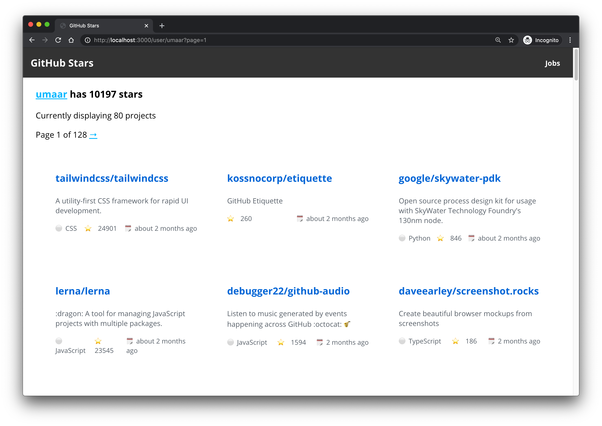
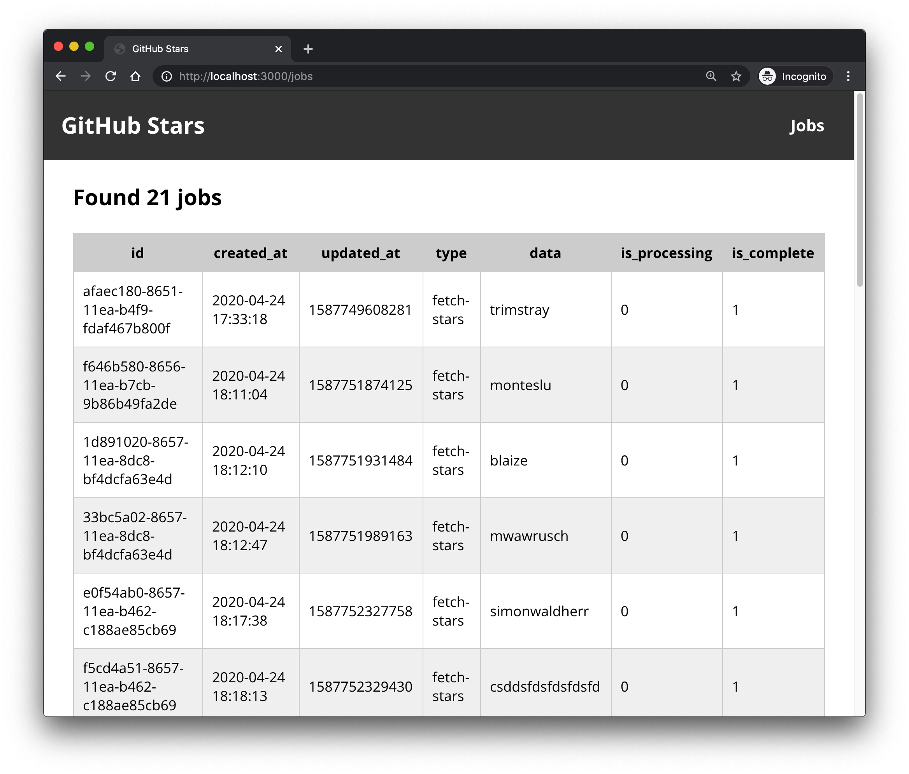

# export-github-stars-sqlite-express-octokit

# 🚀 A Node.js webapp to scrape the stars of specified GitHub users 🚀

https://github.com/coding-to-music/export-github-stars-sqlite-express-octokit

From / By https://github.com/umaar/export-github-stars

## Environment variables:

```java
GITHUB_TOKEN=your token here

# Any name for your new database

DATABASE_NAME=output
```

## GitHub

```java
git init
git add .
git remote remove origin
git commit -m "first commit"
git branch -M main
git remote add origin git@github.com:coding-to-music/export-github-stars-sqlite-express-octokit.git
git push -u origin main
```

### GitHub Star Export

[](https://github.com/umaar/export-github-stars/actions)

Export _all_ your GitHub stars.



This webapp queries the GitHub API to query for the stars of a GitHub user, and stores them in an SQLite database. 10,000 stars will occupy ~6mb worth of data.

This repo uses persistent queues, and supports resumable downloading of stars. You can fetch stars of many users.



#### To run

1. Get a GitHub token from https://github.com/settings/tokens

2. Create a `.env` file:

```
# Contents of .env

GITHUB_TOKEN=your token here

# Any name for your new database
DATABASE_NAME=output
```

3. Run these commands:

```sh
npm i
make migrate-db-dev
make start
```

### TODO:

- Send emails using an email service about database size changes
- Automatically update user stars every ~ few hours
- Insert stars/repos using transactions in bulk
- Implement ajax for pagination
- Cache users and their star counts
- Use http://nvd3.org/ to visualise a users stars over time
- For many stars, should I use something like this https://github.com/tbranyen/hyperlist
- Configure pooling correctly: https://github.com/tgriesser/knex/issues/2820#issuecomment-481710112 e.g.

```
"pool": {
  "min": 2,
  "max": 6,
  "createTimeoutMillis": 3000,
  "acquireTimeoutMillis": 30000,
  "idleTimeoutMillis": 30000,
  "reapIntervalMillis": 1000,
  "createRetryIntervalMillis": 100,
  "propagateCreateError": false // <- default is true, set to false
},
```

## Was not able to do `npm install` so check for latest versions of dependancies

````java
ncu
```


```java
 @octokit/rest                   ^18.0.9  →  ^19.0.5
 body-parser                     ^1.19.0  →  ^1.20.1
 config                           ^3.3.2  →   ^3.3.8
 connect-session-knex             ^2.0.0  →   ^3.0.0
 cookie-parser                    ~1.4.5  →   ~1.4.6
 date-fns                        ^2.16.1  →  ^2.29.3
 debug                            ^4.3.0  →   ^4.3.4
 dotenv                           ^8.2.0  →  ^16.0.3
 escape-goat                      ^3.0.0  →   ^4.0.0
 express                         ^4.17.1  →  ^4.18.2
 express-session                 ^1.17.1  →  ^1.17.3
 forcedomain                      ^2.1.1  →  ^2.2.11
 got                             ^11.8.0  →  ^12.5.2
 knex                           ^0.21.12  →   ^2.3.0
 nunjucks                         ^3.2.2  →   ^3.2.3
 passport                         ^0.4.1  →   ^0.6.0
 sqlite3                          ^5.0.0  →   ^5.1.2
 uuid                             ^8.3.1  →   ^9.0.0
 @umaar/personal-eslint-config    ^1.0.3  →   ^1.0.5
 del                              ^6.0.0  →   ^7.0.0
 gulp-replace                     ^1.0.0  →   ^1.1.3
 gulp-rev-rewrite                 ^4.0.0  →   ^5.0.0
 gulp-sass                        ^4.1.0  →   ^5.1.0
 rollup                          ^2.33.3  →   ^3.2.3
 vinyl-paths                      ^3.0.1  →   ^5.0.0
 xo                              ^0.34.2  →  ^0.52.4

Run ncu -u to upgrade package.json
````

## Seed the sqlite3 database

```
make migrate-db-dev
```

Output

```
./node_modules/.bin/knex migrate:latest --env development
Using environment: development
Batch 1 run: 3 migrations
```
